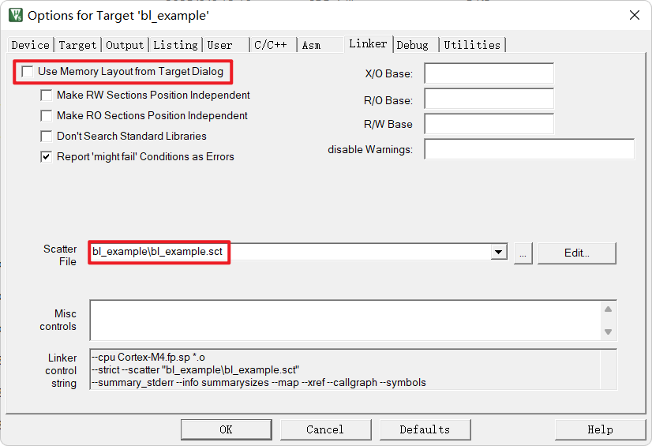

<div align="center">
  
  <h1>SimpleBootloader</h1>
  <span>一个轻量级、模块化的 C 语言 Bootloader 方案</span>
</div>
<br>
<div align="center">
  
  
</div>

## 配置文件

### `bl_config.h`

- **重要参数**
  - `BL_FLASH_BASE_ADDRESS`  
    Bootloader 在 Flash 中的起始地址。烧录 Bootloader 时需与此地址保持一致

  - `BL_APPLICATION_ADDRESS_A` / `BL_APPLICATION_ADDRESS_B`  
    主/备应用区的起始地址。支持双应用区（A/B 区）管理，升级后可回退。每个应用区需独立分区，避免与 Bootloader 区重叠

  - `BL_FRIWARE_INFO_ADDRESS`  
    固件信息存储区地址。用于保存每个应用区的固件元数据（如版本、大小、校验值等）

  - `BL_APPLICATION_NUMBER`  
    支持的应用区数量

  - `BL_USE_CONSTRUCTOR_ATTRIBUTE_RRD`  
    是否启用构造函数属性（`__attribute__((constructor))`），用于自动执行 Bootloader 预处理流程

- **魔数**
  - `BL_UPGRADE_MAGIC_RRD`  
    固件升级的 Magic 标记

  - `BL_SWITCH_APP_MAGIC_RRD`  
    应用区切换的 Magic 标记

  - `BL_RESET_APP_MANAGER_MAGIC_RRD`  
    应用管理器重置的 Magic 标记

  - `BL_FIRWARE_INFO_MAGIC_RRD`  
    固件信息区的 Magic 标记，用于校验信息区有效性

  - `BL_JUMP_APP_FLAG_MAGIC_RRD`  
    跳转到应用程序前的标志 Magic

- **超时配置参数**
  - `BL_TIMEOUT_NO_OPERATE_RRD`  
    无操作超时时间（单位：ms），超时后进入固件或待机等待固件加载

  - `BL_TIMEOUT_DOWNLOAD_RRD`  
    下载超时时间（单位：ms），用于升级过程中超时保护

### `bl_platform_config.h`

- **重要接口**
  - `bl_platform_device_init` / `bl_platform_device_deinit`  
    设备初始化与反初始化函数指针。需由用户根据目标平台实现，主要用于初始化/释放外设资源
    `bl_platform_device_deinit`主要用于释放内存，Simplebootloader 使用复位跳转应用固件，无需手动释放外设资源

  - `bl_platform_system_reset`  
    系统复位函数指针。实现后可在 Bootloader 内部调用，实现软复位以跳转应用到固件

  - `bl_platform_enable_irq` / `bl_platform_disable_irq`  
    全局中断使能与关闭函数指针。用于 Bootloader 关键流程的中断控制

  - `bl_platform_get_systick`  
    获取系统时间戳，用于超时判断

- **其他接口**
  - `SECTION_NO_INIT`  
    用于定义 NO_INIT 区域的宏。NO_INIT 区域内变量不会被初始化，用于保存升级标志和固件跳转地址。需结合链接脚本或 scatter 文件正确配置

  - `BL_CONSTRUCTOR_ATTRIBUTE`  
    构造函数属性宏。

## 平台接口
主要用于注册和管理 Bootloader 支持的通信通道、Flash 设备和调试通道

### `bl_platform.h`

- 用户在移植或集成时，需调用以下接口完成底层资源注册：
  - `bootloader_platform_register_comm(bl_comm_rrd *comm)`：注册通信通道（如串口、CAN、USB 等）
  - `bootloader_platform_register_flash(bl_flash_rrd *flash)`：注册 Flash 设备驱动
  - `bootloader_platform_register_debug_com_dev(bl_comm_rrd *comm)`：注册调试通信设备（可选）

## 设备抽象

### 通信设备父类（bl_comm.h）
SimpleBootloader 通过检测由 `bootloader_platform_register_comm(bl_comm_rrd *comm)` 注册的 `bl_comm_rrd` 结构体中的 `dev_rx_buff` 和 `curr_data_buff`，分别用于指令解析和固件数据接收，实现指令与固件的分离处理

- **结构体说明**
  - `bl_comm_rrd`：通信设备对象，包含接口指针、接收缓冲区、当前数据缓冲区和平台相关数据指针
  - `bl_comm_interface_rrd`：通信接口函数集合，需实现如下函数指针：
    - `write(self, data, length)`：发送数据接口
    - `switch_buff(self, buff_addr)`：切换 DMA 环形缓冲区接口。SimpleBootloader 采用双缓冲区设计，将指令通信缓冲区与升级固件接收缓冲区分离，既能减少 RAM 占用，又支持多个通信设备同时参与固件升级

- **主要成员**
  - `dev_rx_buff`：设备接收缓冲区
  - `curr_data_buff`：当前数据缓冲区指针，用于保存指令通信缓冲区或升级固件接收缓冲区指针
  - `platform_data`：平台相关的自定义数据指针，一般用于保存子类对象指针

- **使用说明**
  1. 用户需实现 `write` 和 `switch_buff` 函数，并填充到 `bl_comm_interface_rrd` 结构体
  2. 初始化 `bl_comm_rrd` 对象并使用 `bootloader_platform_register_comm` 注册到 Bootloader
  3. 支持多通道通信设备并行注册和管理

- **其他**
  - **DMA_CIRCULAR_QUEUE_RRD**
    - **相关方法：**
      - `enqueue(self, value)`：将单个数据单元写入队列
      - `batch_enqueue(self, buff, size)`：批量写入数据到队列，适合 DMA 或中断批量接收场景
      - `dma_circular_queue_init(self, buff_lenth, unit_size, buff_alignment)`: 初始化环形队列，分配指定长度和单元大小的缓冲区。部分平台（如 DMA 访问要求）需要缓冲区地址满足特定的对齐要求，因此提供 buff_alignment 参数，确保分配的内存地址满足硬件对齐需求
    - **使用流程：**
      1. 调用 `dma_circular_queue_init`初始化 `DMA_CIRCULAR_QUEUE_RRD`
      2. 在中断或 DMA 回调中，使用`enqueue(self, value)`或者 `batch_enqueue(self, buff, size)` 将新接收的数据加入到 `curr_data_buff`

### Flash 设备父类（bl_flash.h）

- **结构体说明**
  - `bl_flash_rrd`：Flash 设备对象，包含接口指针和平台相关数据指针
  - `bl_flash_interface_rrd`：Flash 操作接口函数集合，需实现如下函数指针：
    - `read(self, start_addr, buff, length)`：Flash 读取接口
    - `write(self, start_addr, buff, length)`：Flash 写入接口
    - `write_pre(self, start_addr)`：写入前准备（如擦除等）

- **主要成员**
  - `platform_data`：平台相关的自定义数据指针，一般用于保存子类对象指针

- **使用说明**
  1. 用户需实现 `read`、`write`、`write_pre` 函数，并填充到 `bl_flash_interface_rrd` 结构体
  2. 初始化 `bl_flash_rrd` 对象并使用 `bootloader_platform_register_flash` 注册到 Bootloader
  3. 仅支持注册一个Flash设备

### 开发流程

1. **实现接口函数**：根据目标硬件实现通信和 Flash 的接口函数
2. **填充接口结构体**：将实现的函数指针填入接口结构体
3. **初始化设备对象**：创建并初始化 `bl_comm_rrd` 或 `bl_flash_rrd` 对象
4. **注册到 Bootloader**：通过 `bootloader_platform_register_comm` 或 `bootloader_platform_register_flash` 完成注册

## 注意事项

### NO_INIT 相关

#### **Keil** 
[**.sct示例**](./ld_example/bl_example.sct)

**1. 修改Keil配置**




**2. 修改`scatter`文件（.sct）**
- 修改前：
  ```text
  LR_IROM1 0x08000000 0x00020000  {    ; load region size_region
    ER_IROM1 0x08000000 0x00020000  {  ; load address = execution address
    *.o (RESET, +First)
    *(InRoot$$Sections)
    .ANY (+RO)
    .ANY (+XO)
    }
    RW_IRAM1 0x20000000 0x00000400  {
      .ANY (+RW +ZI)
    }
  }
  ```
- 修改后：
    ```text
    LR_IROM1 0x08000000 0x00020000  {    ; load region size_region
      ER_IROM1 0x08000000 0x00020000  {  ; load address = execution address
      *.o (RESET, +First)
      *(InRoot$$Sections)
      .ANY (+RO)
      .ANY (+XO)
      }
      RW_IRAM1 0x20000000 0x00007C00  {  ; 减小 RW 区间到 31KB
        .ANY (+RW +ZI)
      }
      RW_IRAM2 0x20007C00 UNINIT 0x00000400 { ; 最后1KB用于 NO_INIT
        .ANY (NO_INIT)
      }
    }
    ```

#### **GNUC**
[**.ld示例**](./ld_example/STM32G431RBTx_FLASH.ld)

**1. 打开链接文件（.ld），在 `.bss` 后添加 `.noinit`**
- 修改前：
  ```text
  ...
  /* Uninitialized data section */
  . = ALIGN(4);
  .bss :
  {
    /* This is used by the startup in order to initialize the .bss secion */
    _sbss = .;         /* define a global symbol at bss start */
    __bss_start__ = _sbss;
    *(.bss)
    *(.bss*)
    *(COMMON)

    . = ALIGN(4);
    _ebss = .;         /* define a global symbol at bss end */
    __bss_end__ = _ebss;
  } >RAM
  ...
  ```
- 修改后：
  ```text
  ...
  /* Uninitialized data section */
  . = ALIGN(4);
  .bss :
  {
    /* This is used by the startup in order to initialize the .bss secion */
    _sbss = .;         /* define a global symbol at bss start */
    __bss_start__ = _sbss;
    *(.bss)
    *(.bss*)
    *(COMMON)

    . = ALIGN(4);
    _ebss = .;         /* define a global symbol at bss end */
    __bss_end__ = _ebss;
  } >RAM

  /* Uninitialized non-zeroed data section (NO_INIT) */
  .noinit (NOLOAD) :
  {
    . = ALIGN(4);
    *(.noinit)
    *(.NO_INIT)
    *(.noinit*)
    . = ALIGN(4);
  } >RAM
  ...
  ```

### 应用固件相关
- **应用程序（App）的起始地址必须与 Bootloader 配置文件中的 `BL_APPLICATION_ADDRESS_X` 保持一致**
- **下载到设备的固件文件必须为 bin 格式，不支持 hex 或 elf 格式**
- `Magic` 宏（如升级、切换、复位等命令）为**32位无符号整数**，在通信和存储时需保证**大小端一致**，采用**字节序表示**（即按内存实际字节顺序传输），**不是字符串**，避免因端序不一致导致命令识别失败
- 如果未启用 `BL_CONSTRUCTOR_ATTRIBUTE`（即没有 `__attribute__((constructor))`），**必须在主函数 `main()` 的最顶部手动调用 `bootloader_pre_main()`**，以确保跳转标志和启动流程正确执行
- 烧录 Bootloader 和应用程序时，务必确认各自的起始地址、大小和分区不重叠，避免覆盖
- 使用部分擦除功能升级应用时，切勿擦除 Bootloader 和固件信息区，防止系统无法启动或回退
- 若使用 NO_INIT 区域，需确保链接脚本或`scatter`文件正确分区，避免与正常 RAM避免与正常`RAM`区域重叠
- `Bootloader`和应用程序的起始地址必须以 Flash 页大小对齐，避免因未对齐导致擦写异常或启动失败。请根据芯片 Flash 页大小（如 STM32 常见为 2KB、4KB、8KB 等）合理设合理设置 `BL_FLASH_BASE_ADDRESS`、`BL_APPLICATION_ADDRESS_A/B` 等地址参数。


## 声明

该项目 **SimpleBootloader** 使用 Apache License 2.0 授权发布，具体内容请参阅 [**LICENSE**](/LICENSE)