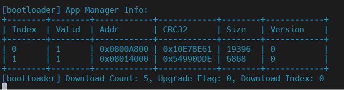

<div align="center">
  
  <h1>SimpleBootloader</h1>
  <span>一个轻量级、模块化的 C 语言 Bootloader 方案</span>
</div>
<br>
<div align="center">
  
  
</div>
<p align="center">
<a href="./Docs/README_en.md">English</a> | <a href="">简体中文</a>
</p>

## 项目简介
**SimpleBootloader** 是一个面向嵌入式系统的轻量级 C 语言 Bootloader，支持固件升级、应用跳转、通信协议扩展等功能，结构清晰，易于集成和二次开发。




## 特性
- 支持双应用区（A/B 区）管理，升级后可回退。每个应用区具有独立的固件信息（地址、大小、版本、CRC32 校验），启动前自动校验固件完整性
- 内置 XMODEM/YMODEM 等主流串口升级协议，支持128/1K数据包、CRC16/SUM校验和失败重传，可扩展 CAN、USB、以太网等多种通信方式
- 内置多级调试输出接口，支持彩色日志、断言、性能统计等功能。调试输出可灵活重定向到串口、半主机等多种通道
- 具备灵活的超时保护机制保障机制
- 底层通信缓冲区采用高效 DMA 环形队列
- 代码模块化，易于裁剪和扩展
- 支持 `Keil MDK(ARMCC)`、`GNUC` 和 `IAR(ICCARM)`

## 目录结构
- `Bootloader/`
  - `include/`：头文件及各功能模块接口
    - `AlgorithmSuite/` 算法相关模块
    - `DebugSuite/` 调试与日志模块
    - `ModemSuite/` 协议相关模块
  - `interface/` Bootloader 对外接口
  - `src/`：Bootloader 主体源码
    - `bl_devices/` 通信、Flash 等设备驱动
    - `bl_jump_asm/` 多编译器支持的跳转汇编实现
- `Docs/`：文档与说明
- `Example/`：示例工程与参考代码

## 快速开始

### 1. 克隆仓库
```bash
git clone https://github.com/Rev-RoastedDuck/SimpleBootloader.git
cd SimpleBootloader/Bootloader
```
**如果需要获取项目示例，需要执行以下命令：**
``` bash
git lfs install
git lfs pull --include="Example/stm32g431rbt6/**"
```

### 2. 配置项目文件
- 进入 `Bootloader/interface/bl_config.h`，根据实际 Flash 分区和应用需求，配置参数
- 进入 `Bootloader/interface/bl_platform_config.h`，根据目标平台实现或适配接口
- 进入 `Bootloader/src/bl_platform.h`，根据实际硬件平台和通信需求，完成通信接口和 Flash 设备的注册

### 3. 配置 no_init 区域
  ```text
  LR_IROM1 0x08000000 0x00020000  {    ; load region size_region
    ER_IROM1 0x08000000 0x00020000  {  ; load address = execution address
    *.o (RESET, +First)
    *(InRoot$$Sections)
    .ANY (+RO)
    .ANY (+XO)
    }
    RW_IRAM1 0x20000000 0x00007C00  {  ; 减小 RW 区间到 31KB
      .ANY (+RW +ZI)
    }
    RW_IRAM2 0x20007C00 UNINIT 0x00000400 { ; 最后1KB用于 NO_INIT
      .ANY (NO_INIT)
    }
  }
  ```

### 4. 烧录
- 将生成的 Bootloader 固件烧录至目标板 Flash 起始地址，按需配置应用程序地址
- 升级或烧录应用程序时，建议选用**部分擦除**

## 文档
使用**SimpleBootloader**之前，请阅读[帮助文档](./Docs/user-guide/SimpleBootolader_manual_cn.md)，你想知道的，都在这里~

## 待办事项
- 提供图形化升级工具和上位机支持
- 增强断点续传与升级失败自动恢复机制
- 增加安全加密升级（如 AES、RSA 签名校验）功能

## 声明
该项目 **SimpleBootloader** 使用 Apache License 2.0 授权发布，具体内容请参阅 [**LICENSE**](./LICENSE)